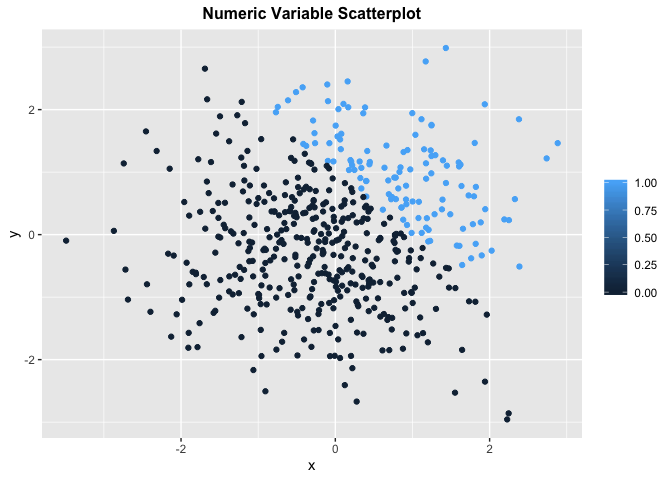

p8105\_hw1\_dz2426
================
Duzhi Zhao
9/13/2019

``` r
library(tidyverse)
```

    ## ── Attaching packages ──────────────────────────────────────────────── tidyverse 1.2.1 ──

    ## ✔ ggplot2 3.2.1     ✔ purrr   0.3.2
    ## ✔ tibble  2.1.3     ✔ dplyr   0.8.3
    ## ✔ tidyr   0.8.3     ✔ stringr 1.4.0
    ## ✔ readr   1.3.1     ✔ forcats 0.4.0

    ## ── Conflicts ─────────────────────────────────────────────────── tidyverse_conflicts() ──
    ## ✖ dplyr::filter() masks stats::filter()
    ## ✖ dplyr::lag()    masks stats::lag()

``` r
library(ggplot2)
```

# Problem 1

## Section 1

The chunk below creates a data frame containing a random sample of size
8 from a standard normal distribution, a logical vector indicating
whether the element of the sample is greater than 0, a character vector
of length 8, and a factor vector of length 8 with 3 different factor
levels, and also produces the mean of each variable.

``` r
#Data frame
df_1 = tibble(
  random_samp = rnorm(8),
  log_vec = random_samp > 0,
  char_vec = as.character("a","b","c","d","e","f","g","h"),
  fac_vec = factor(c("jazz","rock","blues","jazz","jazz","rock","blues","rock"))
)

#Take the mean of each variable
mean_random_samp = mean(pull(df_1, random_samp))
mean_log_vec = mean(pull(df_1, log_vec))
mean_char_vec = mean(pull(df_1, char_vec))
mean_fac_vec = mean(pull(df_1, fac_vec))
```

Comment 1: <br /> The mean of the random sample is -0.28. <br /> The
mean of the logic vector is 0.5. <br /> The mean of the character vector
is NA. <br /> The mean of the factor vector is NA. <br />

``` r
#Convert the logical, character, and factor vector to numeric variable
as.numeric(pull(df_1, log_vec))
as.numeric(pull(df_1, char_vec))
as.numeric(pull(df_1, fac_vec))
```

Comment 2: <br /> After executing as.numeric function, the logical
vector shows a series of “1” and “0”, indicating if the statement is
true. The character vector still shows “NA” for each data entry and this
explains why it does not show a mean value. The factor vector turns out
to be a series of number indicating each data entry’s corresponding
“level”. In general, this shows that the numeric and logical vectors
can show their mean values, while the character and factor variables can
not.

## Section 2

Here is the second code
    chunk:

``` r
as.numeric(pull(df_1, log_vec)) * pull(df_1, random_samp)
```

    ## [1] 0.49097248 0.51857918 0.07982578 0.00000000 0.00000000 0.00000000
    ## [7] 0.00000000 0.53718810

``` r
as.factor(pull(df_1, log_vec)) * pull(df_1, random_samp)
```

    ## Warning in Ops.factor(as.factor(pull(df_1, log_vec)), pull(df_1,
    ## random_samp)): '*' not meaningful for factors

    ## [1] NA NA NA NA NA NA NA NA

``` r
as.numeric(as.factor(pull(df_1, log_vec))) * pull(df_1, random_samp)
```

    ## [1]  0.9819450  1.0371584  0.1596516 -1.4371491 -0.8483893 -0.3902239
    ## [7] -1.1923654  1.0743762

# Problem 2

## Section 1

Here is the data frame for problem 2:

``` r
#Data frame
df_2 = tibble(
  x = rnorm(500),
  y = rnorm(500),
  log_vec_2 = x + y > 1,
  num_vec_2 = as.numeric(log_vec_2),
  fac_vec_2 = as.factor(log_vec_2)
)

#mean, median and standard deviation of x
mean_x = mean(pull(df_2, x))
median_x = median(pull(df_2, x))
sd_x = sd(pull(df_2, x))

#Proportion of cases for which x+y>1
prop_case = mean(pull(df_2, log_vec_2))
```

Description of data frame: <br /> The size of the data set is 500 and 5.
<br /> The mean, median and standard deviation of x are 0.06, 0.05 and
1.03, respectively. <br /> The proportion of cases for which x+y\>1 is
0.27.

\#\#Section 2

``` r
with(df_2, plot(x, y, xlab = "x", ylab = "y", 
                         main = "Logical Variable Scatterplot", type = "n"))
with(subset(df_2, log_vec_2 == 'FALSE'), points(x, y, col = 'red'))        
with(subset(df_2, log_vec_2 == 'TRUE'), points(x, y, col = 'blue'))
legend("bottomright", pch = 1, col = c("red","blue"), 
       legend = c("FALSE","TRUE"))
```

<!-- -->

``` r
with(df_2, plot(x, y, xlab = "x", ylab = "y", 
                         main = "Numeric Variable Scatterplot", type = "n"))
with(subset(df_2, num_vec_2 == '0'), points(x, y, col = 'red'))        
with(subset(df_2, num_vec_2 == '1'), points(x, y, col = 'blue'))
legend("bottomright", pch = 1, col = c("red","blue"), 
       legend = c("0 = FALSE","1 = TRUE"))
```

<!-- -->

``` r
with(df_2, plot(x, y, xlab = "x", ylab = "y", 
                         main = "Factor Variable Scatterplot", type = "n"))
with(subset(df_2, fac_vec_2 == 'FALSE'), points(x, y, col = 'red'))        
with(subset(df_2, fac_vec_2 == 'TRUE'), points(x, y, col = 'blue'))
legend("bottomright", pch = 1, col = c("red","blue"), 
       legend = c("level 1 = FALSE","level 2 = TRUE"))
```

<!-- -->
Comment 3: <br />
